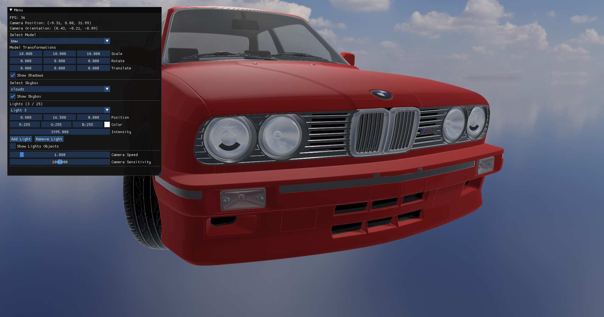

### Model Viewer

This is a simple model viewer for the glTF format. It is written in C++ and uses OpenGL 3.

## Soruces of the taken code

I like to thank the following sources for the code I used in this project:

[https://github.com/mfl28/opengl-cpp-starter](https://github.com/mfl28/opengl-cpp-starter)

[https://learnopengl.com/Introduction](https://learnopengl.com/Introduction)

[https://github.com/JoeyDeVries/LearnOpenGL](https://github.com/JoeyDeVries/LearnOpenGL)

[OpenGL Youtube Tutorial](https://www.youtube.com/watch?v=XpBGwZNyUh0&list=PLPaoO-vpZnumdcb4tZc4x5Q-v7CkrQ6M-)

## How to import models to project

Download model in gltf format and put folder it in the models folder.

## How to run project

```bash
#build
cmake -B build
cmake --build build
#run
./build/main
```

## Screenshots




